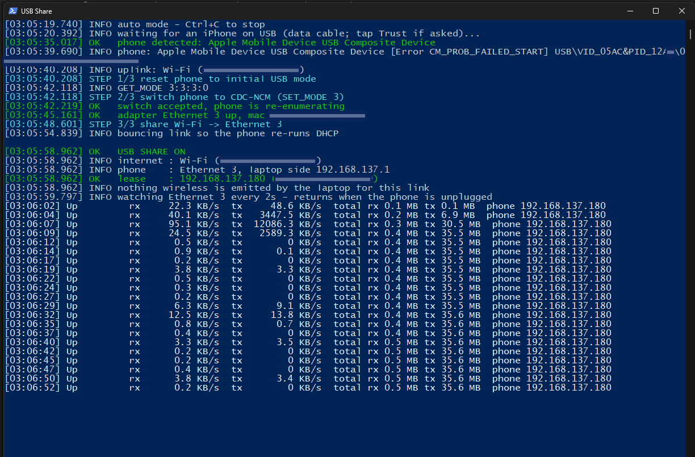

# iPhone USB Reverse Tethering on Windows

**Share a Windows laptop's internet with an iPhone over a USB cable. No Wi-Fi hotspot, no Bluetooth, no extra hardware. It uses the same CDC-NCM path macOS "Internet Sharing → iPhone USB" uses, reproduced on Windows 11 with in-box drivers.**

`reverse tethering` · `iPhone` · `Windows 11` · `CDC-NCM` · `usbccgp` · `Internet Connection Sharing` · `hotel wifi one device limit` · `USB Ethernet` · `usbmuxd mode switch`

---

## TL;DR




Run `Setup.ps1` once. From then on, double-click `USB Share.cmd`, plug the iPhone in, and 15 to 25 s later the phone shows **Settings → Ethernet** with a `192.168.137.x` address routed through the laptop's Wi-Fi. Unplug and replug whenever; it re-arms itself. Nothing is transmitted over the air by the laptop. Works with the phone locked. No "Trust This Computer" prompt.

Tested on Windows 11 (build 26200), an iPhone with USB `PID 12A8`, iOS 17-era descriptors.

**Built on a flight to Bangkok.** The in-flight Wi-Fi only allowed one device, so the laptop had the session while the phone was left out. I could've just shared it normally via hotspot—that probably would've worked—but I wanted something more stealthy and interesting. With nothing to buy at 11 km altitude, the only options left were reading Windows driver docs and USB descriptors. A fun little experiment that turned into a small piece of Windows USB-stack archaeology. Committed this straight from the plane. (I hate that they don't have Starlink yet btw)

## Why this is possible

An iPhone will happily take a network from a USB Ethernet adapter. It just doesn't present itself as one when plugged into a computer. It waits for the host to ask.

[Synacktiv's research](https://www.synacktiv.com/en/publications/ios-a-journey-in-the-usb-networking-stack) showed that macOS Internet Sharing sends **one proprietary vendor control request** to the phone:

```
bmRequestType=0xC0  bRequest=0x52  wValue=0  wIndex=<mode>  wLength=1     (mode 3 = CDC-NCM)
```

The phone answers `[0]`, drops off the bus, and re-enumerates with an **extra USB configuration containing a standard CDC-NCM Ethernet function**. From then on it behaves like any USB NIC: link up → DHCP request → routes via the gateway that answers. Linux gained this years ago via `usbmuxd` (`USBMUXD_DEFAULT_DEVICE_MODE=3`). Nothing about it is Mac-specific.

So the work reduces to two things Windows doesn't do by default: send that request, and bring up the resulting interface with the in-box `UsbNcm` driver.

## What actually stood in the way (Windows)

The mode switch worked on the first try. Everything else was Windows, plus one iOS behaviour.

| # | Obstacle | Root cause | Fix |
|---|----------|-----------|-----|
| 1 | User-space can't reach the phone's control endpoint | Parent device owned by `usbccgp`, which exposes no control-transfer API | `libusb-win32` **filter driver** (Microsoft WHQL catalog) on the iPhone composite device only. Its installer registers the service but never copies `libusb0.sys`; `Setup.ps1` does. |
| 2 | Windows keeps selecting USB configuration 1 (photos only); the documented `OriginalConfigurationValue` knob is ignored and zeroed on every restart | **Apple's own `AppleLowerFilter.sys`** (shipped via Windows Update with their composite-device INF) sits under `usbccgp`, forces config 1 and zeroes the value | Detach it from the iPhone's device key (`LowerFilters`). The knob works immediately. |
| 3 | Device fails to start after the switch, or the switch is rejected | The phone honours the switch **only from its initial mode**; any PnP restart resets it to initial; the NCM config index is out of range in initial mode → `usbccgp` fails to start (taking the filter with it) | Ordered sequence: index 2 → restart → verify `GET_MODE 3:3:3:0` → write index 4 → `SET_MODE 3`. Every other order fails. |
| 4 | `UsbNcm` binds but `CM_PROB_FAILED_START` | Phone emits **no Interface Association Descriptor**; `usbccgp` splits NCM control and data into separate PDOs | Enable `usbccgp`'s CDC enumeration (`EnumeratorClass = 02 00 00` on its software key) so it groups by the **Union descriptor** the phone does provide → `…&CDC_0D&MI_02`, driver starts. |
| 5 | Sequence dies mid-way; "Trust This Computer?" on the phone | Windows' photo-import driver (WPD/PTP) opens a session → iOS asks for trust → **iOS resets its USB connection after the answer**, back to initial mode while Windows still has the NCM index armed | Disable the PTP interface (`Apple iPhone` under Portable Devices). Nothing else opens a session, so iOS never asks. |
| 6 | First attempt after a fresh plug-in sometimes loses the adapter ~40 s in | iOS performs one USB reset shortly after a new connection [observed consistently; no Windows-side trigger found] | Detect the vanished adapter, restore the safe index, retry. Second pass sticks. |

After that it's boring: `Ethernet N` appears, Internet Connection Sharing NATs Wi-Fi onto it and serves DHCP, the phone leases `192.168.137.x`. A `pktmon` capture on the link showed the phone doing HTTPS to a Cloudflare edge through the laptop. That was the proof.

Side note on iOS ≥ 16: the phone exposes **two** NCM functions. The second has no interrupt endpoint and is Apple's RemoteXPC channel; it fails to start on Windows and that's fine. The first (with the interrupt EP) is the tether.

## Install

Requirements: Windows 10/11 x64 or ARM64, admin rights, Python 3 on `PATH`, an iPhone with a data cable.

1. Clone or download this repo.
2. Plug the iPhone in.
3. Right-click `Setup.ps1` → *Run with PowerShell* (it self-elevates). It installs `pyusb`, downloads `libusb-win32` 1.4.0.2 from its GitHub release and **verifies the SHA-256**, installs the filter driver **scoped to the iPhone device only**, applies the two `usbccgp` registry settings, detaches Apple's lower filter, restarts the device and checks that `GET_MODE` answers `3:3:3:0`.

Everything Setup changes:

| Change | Where | Reverted by `Uninstall.ps1` |
|---|---|---|
| libusb-win32 filter driver on the iPhone composite device | `libusb0` service, `System32\drivers\libusb0.sys`, `UpperFilters` on the device key | yes |
| `EnumeratorClass = 02 00 00` (REG_BINARY) | `HKLM\SYSTEM\CCS\Control\Class\{88bae032-…}\<usbccgp instance>` | yes |
| `OriginalConfigurationValue` / `AltConfigurationValue` (managed by the script at runtime) | `HKLM\SYSTEM\CCS\Enum\USB\VID_05AC&PID_12A8\<serial>\Device Parameters` | yes (set to 0) |
| `AppleLowerFilter` detached from the iPhone device | `LowerFilters` on the device key | yes |
| Photo-import (PTP/WPD) interface disabled (done by `USB-Share.ps1`, not Setup) | `Apple iPhone` under Portable Devices | yes |
| `pyusb` Python package | user site-packages | no (`pip uninstall pyusb`) |

iTunes / Apple Devices sync (usbmux) is untouched. Photo import over USB is off while installed.

## Usage

```
USB Share.cmd            plug-and-go (default): wait for phone → share → live counters → re-arm on unplug
USB Share.cmd menu       interactive menu
USB Share.cmd on | off   one-shot
USB Share.cmd status     device state, usbccgp index, raw GET_MODE bytes, NCM functions, adapter, share, lease
USB Share.cmd watch      live rx/tx until Ctrl+C
```

`-Verbose` on `USB-Share.ps1` prints the raw tool output and registry writes. Only one instance can run at a time (mutex). `iphone_mode.py get|set <mode>` is the standalone switch tool (`3:3:3:0` = initial, `5:3:3:0` = switched).

## Threat-model notes

- The laptop emits nothing new: its Wi-Fi radio stays a client with one MAC. Upstream sees one device.
- The link is a cable. No SSID, no BSSID, no beacons, no pairing. Observing it means touching it.
- ICS is a NAT with no inbound rules; the phone is not reachable from the upstream network.
- Everything here is documented Windows behaviour (`usbccgp` registry knobs) plus a Microsoft-catalogued filter driver scoped to one device. No kernel patching, no test-signing, no Secure Boot changes.
- The phone is never paired or trusted with the laptop; the mode switch is a bare vendor request that iOS answers before any pairing.

## Limits / known issues

- A Windows Update refresh of Apple's driver package may re-attach `AppleLowerFilter`; symptom is the sequence failing at step 2. Re-run `Setup.ps1`.
- USB Restricted Mode: if the phone has been locked for over an hour, unlock it once after plugging in, otherwise the port is charge-only and Windows sees no device.
- Only tested on one iPhone / iOS / Windows combination. Descriptors may differ across models; `USB Share.cmd status` shows the mode bytes and NCM functions to diagnose.
- Not a product. It's a repeatable experiment.

## Prior art and credits

This project contributes only the Windows integration. The knowledge it stands on:

- **Synacktiv, Florian Le Minoux**: [*iOS: a journey in the USB networking stack*](https://www.synacktiv.com/en/publications/ios-a-journey-in-the-usb-networking-stack) (2024). The USB-level reverse engineering of the mode switch, the CDC-NCM configuration, and the iOS 16/17 dual-interface behaviour. This whole thing exists because of that article.
- **libimobiledevice / usbmuxd**: [`usb.c`](https://github.com/libimobiledevice/usbmuxd/blob/master/src/usb.c) and [issue #205](https://github.com/libimobiledevice/usbmuxd/issues/205): exact `GET_MODE`/`SET_MODE` request parameters and the `USBMUXD_DEFAULT_DEVICE_MODE` implementation for Linux.
- **libimobiledevice issue [#1348](https://github.com/libimobiledevice/libimobiledevice/issues/1348)**: @JJTech0130, @hyphenlee, @muvaf: the Linux recipe and confirmation on recent iPhones.
- **libusb-win32**: [mcuee / dontech](https://github.com/mcuee/libusb-win32): the signed filter driver that makes user-space control transfers possible without replacing Apple's driver. `libusb0.dll` is redistributed here under its LGPL licence; the driver itself is downloaded from the upstream release by `Setup.ps1`.
- **Microsoft docs**: [Configuring Usbccgp.sys to select a non-default configuration](https://learn.microsoft.com/en-us/windows-hardware/drivers/usbcon/selecting-the-configuration-for-a-multiple-interface--composite--usb-d) and [Enumeration of interface collections](https://learn.microsoft.com/en-us/windows-hardware/drivers/usbcon/support-for-interface-collections): the two registry mechanisms that make the NCM function reach the driver.
- **pyusb** for the control transfers.

As far as public record shows, no one had previously documented the real NCM reverse-tether path on Windows; every existing Windows guide uses the phone's own Personal Hotspot in reverse, which is a different (and flaky) mechanism. If you know of earlier work, open an issue and it gets credited here.

## Repo layout

```
Setup.ps1          one-time setup (self-elevating, idempotent, verifies itself)
Uninstall.ps1      reverts everything Setup and the script changed
USB Share.cmd      double-click launcher; passes arguments through
USB-Share.ps1      auto | menu | on | off | status | watch
iphone_mode.py     GET_MODE / SET_MODE tool (pyusb + libusb0)
libusb0.dll        libusb-win32 user-mode library (LGPL, see THIRD_PARTY_NOTICES.md)
libusb-win32/      created by Setup.ps1 (downloaded release; git-ignored)
```

Suggested GitHub topics: `iphone` `reverse-tethering` `windows-11` `usb` `cdc-ncm` `usbccgp` `internet-connection-sharing` `libusb` `ios` `tethering` `usbmuxd` `security-research`
